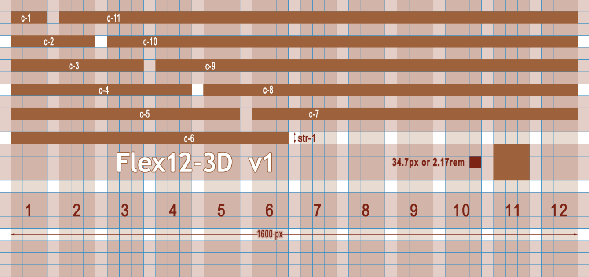

# 🐿️flex12-3D
1 version
**Flex12-3D** — це сучасна, мінімалістична і гнучка CSS FLEX-сітка на 12 колонок, створена для швидкого і зручного розроблення адаптивних веб-інтерфейсів.


---

## Основні переваги Flex12-3D:

- 🔹 **Простота використання:** інтуїтивний класовий підхід для швидкого створення сіток.  
- 🔹 **12 колонок:** класична сітка, оптимальна для будь-яких типів макетів — від простих сторінок до складних додатків.  
- 🔹 **Гнучкість:** легко комбінується з іншими CSS-технологіями та адаптується під будь-які розміри екранів.  
- 🔹 **Мінімалістичний дизайн:** мінімальний CSS-код без зайвих залежностей і фреймворків.  
- 🔹 **3D-ефекти:** з версії 2.0 унікальна фішка — підтримка легких 3D-трансформацій для сучасних UI/UX рішень.  

---

## Зразок коду
```html
<section class="row col-3-3-3-3">
  <div class="c-3">c-3</div>
  <div class="c-3">c-3</div>
  <div class="c-3">c-3</div>
  <div class="c-3">c-3</div>
</section>
<style>
.col-3-3-3-3 > .c-3{width: calc(var(--col-3) - var(--gap-3));}
</style> 
---

## Почати використання

Просто підключи CSS, додай відповідні класи — і ти готовий створювати адаптивні сітки з 3D-ефектами без зайвих складнощів.

---

Долучайся, роби свій код кращим з **Flex12-3D**! 🚀
```


